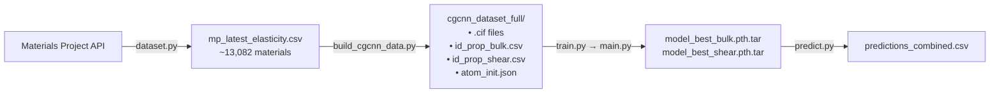
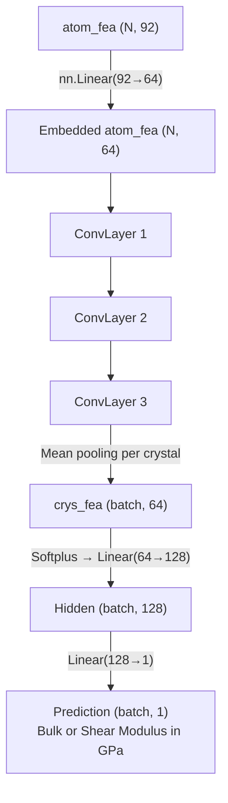
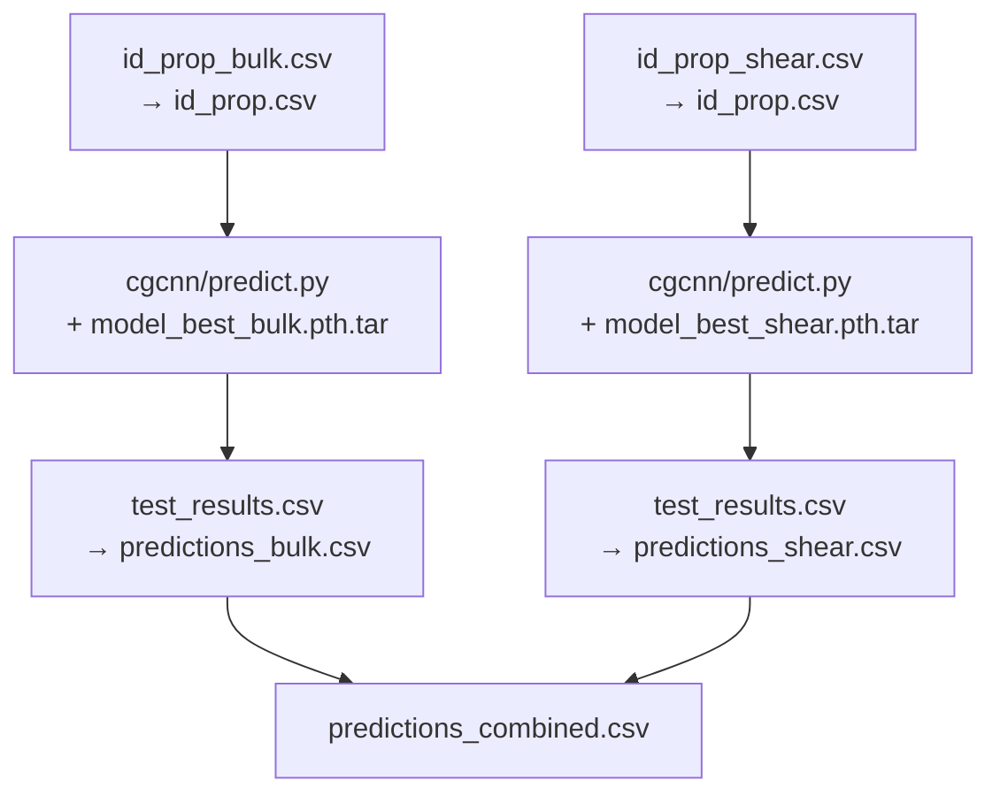

# CGCNN Deep Dive — How Everything Works in Your Project

## 1. The Big Picture

Your project predicts **elastic properties** (Bulk Modulus K and Shear Modulus G, both in GPa) of crystalline materials using a **Crystal Graph Convolutional Neural Network (CGCNN)**. The pipeline has four stages:



---

## 2. What Comes From Materials Project

### Stage 1 — [dataset.py](file:///c:/Users/arvin/Downloads/UGP-Phy/dataset.py): Fetching Elastic Data

Hits the Materials Project REST API (`/materials/elasticity/`) in batches of 1,000, extracting **four fields per material**:

| Field | Description | Example |
|-------|-------------|---------|
| `material_id` | Unique MP identifier | `mp-aaaaaaab` |
| `formula` | Chemical formula | `Cs` |
| `bulk_modulus_vrh` | VRH-averaged bulk modulus (GPa) | `1.974` |
| `shear_modulus_vrh` | VRH-averaged shear modulus (GPa) | `0.604` |

Saves ~13,082 valid rows to [mp_latest_elasticity.csv](file:///c:/Users/arvin/Downloads/UGP-Phy/mp_latest_elasticity.csv).

### Stage 2 — [build_cgcnn_data.py](file:///c:/Users/arvin/Downloads/UGP-Phy/build_cgcnn_data.py): Building the CGCNN Dataset

This script creates two things:

1. **Target CSVs** (no headers, just `material_id,value`):
   - [id_prop_bulk.csv](file:///c:/Users/arvin/Downloads/UGP-Phy/cgcnn_dataset_full/id_prop_bulk.csv) — bulk modulus targets
   - [id_prop_shear.csv](file:///c:/Users/arvin/Downloads/UGP-Phy/cgcnn_dataset_full/id_prop_shear.csv) — shear modulus targets

2. **CIF structure files** — downloads the full 3D crystal structure for each material from the MP `/materials/summary/` endpoint, converts the JSON to a `pymatgen.Structure`, and saves as `.cif` files (e.g., `mp-aaaaaaab.cif`).

> [!IMPORTANT]
> A CIF file encodes the **unit cell geometry** (lattice parameters + angles) and every **atom's fractional coordinates** within that cell. This is what the neural network will turn into a graph.

---

## 3. How Crystals Become Tensors (The Data Pipeline)

This is the core magic. It all happens in [data.py](file:///c:/Users/arvin/Downloads/UGP-Phy/cgcnn/cgcnn/data.py), specifically in the `CIFData.__getitem__()` method ([lines 370–402](file:///c:/Users/arvin/Downloads/UGP-Phy/cgcnn/cgcnn/data.py#L370-L402)).

### Step-by-step for a single crystal

#### 3.1 Load the CIF and Read Atoms

```python
crystal = Structure.from_file("cgcnn_dataset_full/mp-aaaaaaab.cif")
```

For Cesium (Cs), this gives a structure with **1 atom** in the unit cell. For more complex materials, there can be dozens.

#### 3.2 Create Atom Feature Vectors → `atom_fea` tensor

Each atom is represented by a **92-dimensional one-hot-encoded vector** from [atom_init.json](file:///c:/Users/arvin/Downloads/UGP-Phy/cgcnn_dataset_full/atom_init.json). The JSON maps atomic number → feature vector:

```
Element Cs (Z=55) → [0, 1, 0, 0, ..., 0, 1]  (92 values)
Element Pd (Z=46) → [0, 0, 0, ..., 0, 1, 0]  (92 values)
```

These encode elemental properties (electronegativity, group, period, etc.) in a one-hot scheme.

For a crystal with `n` atoms, this produces:

$$\texttt{atom\_fea} \in \mathbb{R}^{n \times 92}$$

```python
# Code from data.py L375-377
atom_fea = np.vstack([self.ari.get_atom_fea(crystal[i].specie.number)
                      for i in range(len(crystal))])
atom_fea = torch.Tensor(atom_fea)   # shape: (n_atoms, 92)
```

#### 3.3 Find Neighbors → Build the Crystal Graph

```python
all_nbrs = crystal.get_all_neighbors(self.radius, include_index=True)
```

For each atom, pymatgen finds all atoms within a radius of **8 Å** (including atoms in neighboring unit cells via periodic boundary conditions). The neighbors are **sorted by distance**.

Only the closest **M = 12 neighbors** are kept (if fewer exist, they're zero-padded).

This step creates two arrays:

| Array | Shape | What it contains |
|-------|-------|-----------------|
| `nbr_fea_idx` | `(n, 12)` | Index of each neighbor atom (integer) |
| `nbr_fea` | `(n, 12)` | Distance to each neighbor (float, in Å) |

#### 3.4 Gaussian Distance Expansion → `nbr_fea` tensor

Raw distances are expanded into a **Gaussian basis** via the [GaussianDistance](file:///c:/Users/arvin/Downloads/UGP-Phy/cgcnn/cgcnn/data.py#L174-L216) class:

$$\text{GDF}(d) = \exp\left(-\frac{(d - \mu_k)^2}{\sigma^2}\right) \quad \text{for } k = 0, 1, ..., K$$

where $\mu_k$ are centers from `dmin=0` to `dmax=8` with `step=0.2`, giving **K = 41 Gaussian filters**.

This transforms each scalar distance into a 41-dimensional vector:

$$\texttt{nbr\_fea}: (n, 12) \xrightarrow{\text{Gaussian}} (n, 12, 41)$$

```python
nbr_fea = self.gdf.expand(nbr_fea)  # (n, 12) → (n, 12, 41)
```

#### 3.5 Final Tensor Conversion

```python
atom_fea   = torch.Tensor(atom_fea)       # (n, 92)    — atom node features
nbr_fea    = torch.Tensor(nbr_fea)        # (n, 12, 41) — edge/bond features
nbr_fea_idx = torch.LongTensor(nbr_fea_idx) # (n, 12) — neighbor index map
target     = torch.Tensor([float(target)])  # (1,) — e.g., 1.974 GPa
```

> [!TIP]
> **Summary of a single crystal's tensor representation:**
>
> | Tensor | Shape | Meaning |
> |--------|-------|---------|
> | `atom_fea` | `(n_atoms, 92)` | What each atom *is* (element identity) |
> | `nbr_fea` | `(n_atoms, 12, 41)` | How far each atom is from its 12 nearest neighbors |
> | `nbr_fea_idx` | `(n_atoms, 12)` | Which atoms are neighbors (graph adjacency) |
> | `target` | `(1,)` | The property to predict (bulk or shear modulus) |

### 3.6 Batching Multiple Crystals — [collate_pool](file:///c:/Users/arvin/Downloads/UGP-Phy/cgcnn/cgcnn/data.py#L118-L171)

Crystals have **different numbers of atoms**, so they can't be stacked naively. The `collate_pool` function concatenates them along the atom axis and shifts neighbor indices:

```
Crystal A: 3 atoms     Crystal B: 5 atoms
atom_fea_A (3, 92)     atom_fea_B (5, 92)
            ↓
batch_atom_fea (8, 92)    ← concatenated

nbr_fea_idx_B += 3        ← indices shifted by A's atom count
```

It also creates `crystal_atom_idx` — a list telling the model which atoms belong to which crystal, used later for **pooling**.

---

## 4. The Model Architecture

Defined in [model.py](file:///c:/Users/arvin/Downloads/UGP-Phy/cgcnn/cgcnn/model.py). The full architecture:



### 4.1 Embedding Layer

```python
self.embedding = nn.Linear(92, 64)
```

Projects the 92-dim raw atom features into a 64-dim learned space.

### 4.2 Graph Convolution Layers — [ConvLayer](file:///c:/Users/arvin/Downloads/UGP-Phy/cgcnn/cgcnn/model.py#L7-L74)

Each of the **3 ConvLayers** does:

1. **Gather neighbor features**: Uses `nbr_fea_idx` to look up each atom's 12 neighbors' current feature vectors
2. **Concatenate**: `[atom_i_features | neighbor_j_features | bond_ij_features]` → shape `(N, 12, 64+64+41)` = `(N, 12, 169)`
3. **Linear transformation**: `nn.Linear(169, 128)` → `(N, 12, 128)`
4. **Gated aggregation**: Split into two halves (filter + core):
   - **Filter** = Sigmoid(first 64 dims) → gating values
   - **Core** = Softplus(last 64 dims) → message values
   - **Message** = Filter × Core, summed across 12 neighbors → `(N, 64)`
5. **Residual**: `output = Softplus(atom_fea_in + aggregated_message)`

> [!NOTE]
> The Sigmoid gating is what makes CGCNN powerful — the network learns *which neighbor interactions matter* and *how much* to weight each one.

### 4.3 Pooling — Crystal-Level Representation

```python
# model.py L185-186
summed_fea = [torch.mean(atom_fea[idx_map], dim=0, keepdim=True)
              for idx_map in crystal_atom_idx]
```

Takes the **mean** of all atom feature vectors in each crystal → one 64-dim vector per crystal.

### 4.4 Fully Connected Head

```python
conv_to_fc:      Linear(64 → 128) + Softplus
fc_out:          Linear(128 → 1)      ← single scalar output
```

The final output is a **single number**: the predicted modulus in GPa.

---

## 5. The Training Loop

### Orchestration: [train.py](file:///c:/Users/arvin/Downloads/UGP-Phy/train.py) → [train_cgcnn.py](file:///c:/Users/arvin/Downloads/UGP-Phy/train_cgcnn.py) → [main.py](file:///c:/Users/arvin/Downloads/UGP-Phy/cgcnn/main.py)

[train.py](file:///c:/Users/arvin/Downloads/UGP-Phy/train.py) runs **two training runs** sequentially:
1. Copies `id_prop_bulk.csv` → `id_prop.csv`, trains, saves `model_best_bulk.pth.tar`
2. Copies `id_prop_shear.csv` → `id_prop.csv`, trains, saves `model_best_shear.pth.tar`

### Training hyperparameters (from [train_cgcnn.py](file:///c:/Users/arvin/Downloads/UGP-Phy/train_cgcnn.py)):

| Parameter | Value |
|-----------|-------|
| Task | Regression |
| Epochs | 50 |
| Batch size | 128 |
| Learning rate | 0.001 |
| Train/Val/Test split | 80% / 10% / 10% |
| Optimizer | SGD (momentum=0.9) |
| Loss function | MSE (Mean Squared Error) |
| LR scheduler | MultiStepLR at epoch 100 |

### Target Normalization ([Normalizer](file:///c:/Users/arvin/Downloads/UGP-Phy/cgcnn/main.py#L426-L446))

Before training, targets are **z-score normalized**:

$$\hat{y} = \frac{y - \mu}{\sigma}$$

computed from a sample of 500 data points. During evaluation, predictions are **de-normalized** back:

$$y = \hat{y} \cdot \sigma + \mu$$

### Training Step (per batch):

```
1. Load batch → (atom_fea, nbr_fea, nbr_fea_idx, crystal_atom_idx), target
2. Normalize target
3. Forward pass → model(atom_fea, nbr_fea, nbr_fea_idx, crystal_atom_idx) → prediction
4. Loss = MSE(prediction, normalized_target)
5. Backpropagate gradients
6. SGD optimizer step
7. Track MAE = mean(|denorm(prediction) - actual_target|)
```

### Checkpointing

After each epoch, the model with the **lowest validation MAE** is saved as `model_best.pth.tar` (later renamed to `model_best_bulk.pth.tar` or `model_best_shear.pth.tar`).

---

## 6. How Predictions Are Returned

[predict.py](file:///c:/Users/arvin/Downloads/UGP-Phy/predict.py) runs the CGCNN prediction script for both models:



For each material:
1. Load the `.cif` file → build crystal graph tensors
2. Forward pass through the saved model
3. **De-normalize** the output: `predicted = output * std + mean`
4. Output: `(cif_id, actual_value, predicted_value)`

The combined CSV has columns:
```
cif_id, bulk_actual, bulk_predicted, bulk_error, shear_actual, shear_predicted, shear_error
```

---

## 7. End-to-End Tensor Flow Example

For a crystal like **CsCl** (2 atoms: Cs + Cl):

```
┌─────────────────────────── CIF File ───────────────────────────┐
│  Cs at (0, 0, 0),  Cl at (0.5, 0.5, 0.5)                      │
│  Unit cell: a=b=c=4.12Å, α=β=γ=90°                            │
└────────────────────────────────────────────────────────────────┘
                              ↓
┌─────────────────────── Tensor Creation ────────────────────────┐
│  atom_fea:     (2, 92)    ← Cs vector + Cl vector              │
│  nbr_fea:      (2, 12, 41) ← 12 nearest neighbors per atom    │
│  nbr_fea_idx:  (2, 12)    ← which atom indices are neighbors   │
│  target:       (1,)       ← 17.3 GPa bulk modulus              │
└────────────────────────────────────────────────────────────────┘
                              ↓
┌──────────────────────── Model Forward ─────────────────────────┐
│  Embedding:     (2, 92)  →  (2, 64)                            │
│  ConvLayer ×3:  (2, 64)  →  (2, 64)   (updated via neighbors)  │
│  Mean Pool:     (2, 64)  →  (1, 64)   (crystal-level)          │
│  FC Head:       (1, 64)  →  (1, 128)  →  (1, 1)                │
│                                                                  │
│  Output: 0.347 (normalized) → denorm → 17.8 GPa (predicted)    │
└────────────────────────────────────────────────────────────────┘
```

---

## 8. Key Design Decisions in Your Code

| Decision | Where | Why |
|----------|-------|-----|
| Windows dtype patch | [data.py L17-34](file:///c:/Users/arvin/Downloads/UGP-Phy/cgcnn/cgcnn/data.py#L17-L34) | pymatgen's Cython expects `int64` but Windows numpy defaults to 32-bit `long` |
| IQR outlier removal | [data.py L339-358](file:///c:/Users/arvin/Downloads/UGP-Phy/cgcnn/cgcnn/data.py#L339-L358) | Removes DFT failures / extreme values outside Q1−3×IQR to Q3+3×IQR |
| LRU cache on `__getitem__` | [data.py L369](file:///c:/Users/arvin/Downloads/UGP-Phy/cgcnn/cgcnn/data.py#L369) | CIF parsing is expensive; caching avoids re-parsing in later epochs |
| `--workers 0` | [train_cgcnn.py L38](file:///c:/Users/arvin/Downloads/UGP-Phy/train_cgcnn.py#L38) | Prevents PyTorch `BrokenPipeError` multiprocessing freezes on Windows |
| Separate bulk/shear models | [train.py](file:///c:/Users/arvin/Downloads/UGP-Phy/train.py) | Each property gets its own trained model (not multi-task) |
